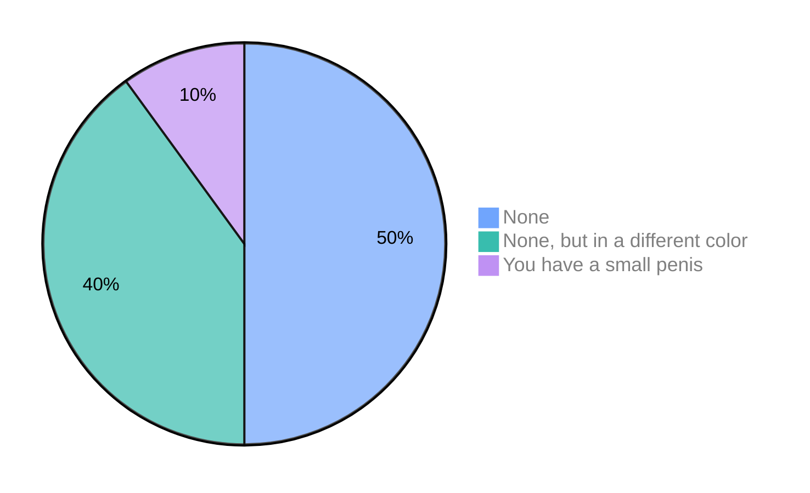

# Hi, I'm Denis Churilov 

  &nbsp;Full Stack Developer & DevOps Engineer from Saint Petersburg, Russia

### Top 3 reasons not to hire me:

<table>
<tr>
<td align="center" width="680">

</td>
</tr>
</table>

<!--  -->

<table>
<tr>
<td width="680">

  
  

</td>
</tr>
</table>
